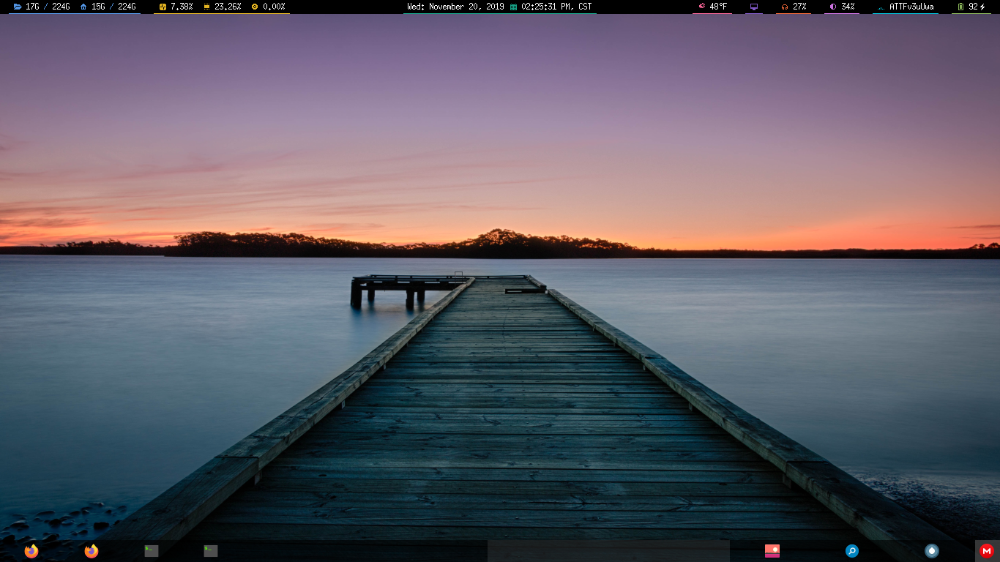
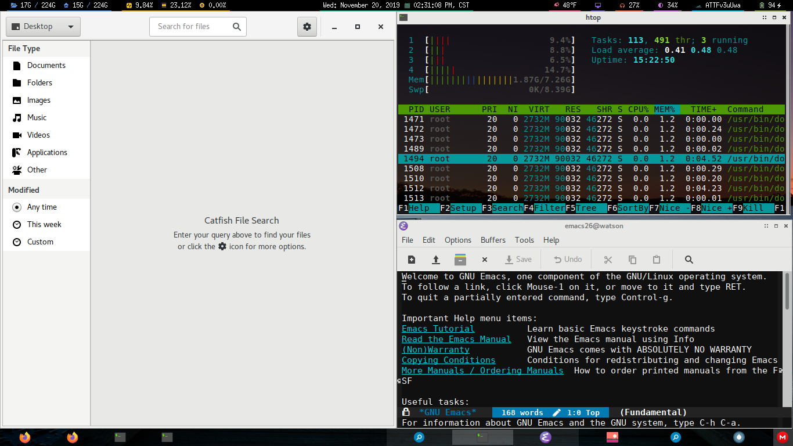
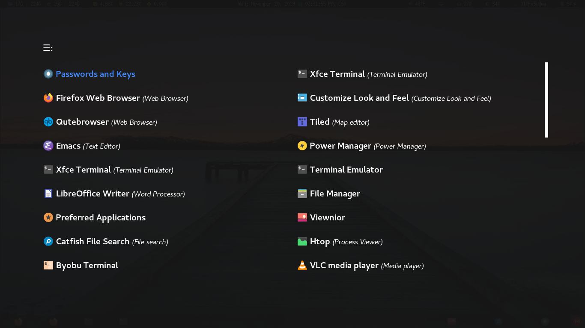

# Diminye Scriptibution

Diminye is a series of scripts that can be run against a minimal Ubuntu install to setup an Openbox desktop environment.

I had created Diminye because I really enjoyed my experience with Crunchbang but still wanted to use Ubuntu.

The goal is to have a lightweight result but I don't know that my preferences are going to necessarily always result in the most lightweight option. I suppose the goal of the project is to have a final result that's usable even if configuration and setup require less than a novice; sans final-product usability, always aim for the least bloated choice.

  

## Applications Installed/Used
